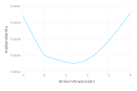
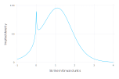

# Package ArbitrageFreeSABR

| Status | Coverage |
| :----: | :----: |
| [](https://travis-ci.org/fabienlefloch/ArbitrageFreeSABR.jl) | [](http://codecov.io/github/fabienlefloch/ArbitrageFreeSABR.jl?branch=master) |


Julia package to accompany the paper [Finite Difference Techniques for Arbitrage-Free SABR](https://www.risk.net/journal-of-computational-finance/2465429/finite-difference-techniques-for-arbitrage-free-sabr). The code is not meant for production purpose and does not cater for corner cases. It is only meant to illustrate the main techniques described in the paper.

## Installation

In a Julia REPL, enter `pkg` mode (by pressing `]`) and run:

```julia
(v1.0) pkg> add ArbitrageFreeSABR
```

[Julia](https://julianlang.org) version 1.0 or higher is required.

## Usage

Start by creating a `SABRMaturity` structure, which represents the parameters of the SABR model for a given option maturity. It takes the SABR parameters α,β,ρ,ν as well as the forward and the expiry time (in fractions of year - `expiry=1.0` means 1 year). An additional parameter specifies the underlying SABRModel, which can be either the standard `ArbitrageFreeSABRModel()` or the `FreeBoundarySABRModel()`.
```julia
maturity = SABRMaturity(α,β,ρ,ν,forward,expiry,ArbitrageFreeSABRModel())
```

Then make a `TransformedDensity` structure via `makeTransformedDensityLawsonSwayne`. This function will solve the arbitrage-free PDE on a grid using the specified number of space steps `N` and time steps `timesteps`, and spanning `nd` standard deviations below and above. `nd=4` is a reasonable choice.
```julia
density = makeTransformedDensityLawsonSwayne(maturity, N, timesteps, nd)
```

And price vanilla call and puts of a given strike by evaluating the `TransformedDensity`.
```julia
priceTransformedDensity(density, true, strike, ArbitrageFreeSABR.midpoint)
```
The second parameter specifies whether we want to price a call (true) or a put (false). The last parameter specifies the interpolation in between grid nodes. The original Hagan et al.(2014) paper corresponds to `ArbitrageFreeSABR.none`, while our paper corresponds to `ArbitrageFreeSABR.midpoint`. In the future, we may add a quadratic interpolation.

## Examples

### Price from the paper: Hagan example
We use the same parameters as the example of negative density with the standard SABR
formula in (Hagan et al., 2014): α = 35%, β = 0.25, ρ = −10%, ν = 100% and forward f = 1% for a maturity of one year.
The finite difference grid extends to `nd=4` standard deviations and is composed of `N=500` steps for the probability density dimension ϑ and 5 time steps.

```julia
using ArbitrageFreeSABR

forward = 1.0; expiry = 1.0;
α = 0.35; β = 0.25; ν = 1.0; ρ = -0.1;
N = 500; timesteps = 5; nd = 4;
maturity = SABRMaturity(α,β,ρ,ν,forward,expiry,ArbitrageFreeSABRModel())
density = makeTransformedDensityLawsonSwayne(maturity, N, timesteps, nd)
isCall = true; strike = forward;
priceTransformedDensity(density, isCall, strike, ArbitrageFreeSABR.midpoint)
```

The reference price is 0.149701955629

### Plot the implied density
Here, we reproduce the plot of the implied density, using the parameters of Hagan et al. (2014), using a small grid.

```julia
using ArbitrageFreeSABR
using Gadfly

forward = 1.0; expiry = 1.0;
α = 0.35; β = 0.25; ν = 1.0; ρ = -0.1;
N = 50; timesteps = 5; nd = 4;
maturity = SABRMaturity(α,β,ρ,ν,forward,expiry,ArbitrageFreeSABRModel())
density = makeTransformedDensityLawsonSwayne(maturity, N, timesteps, nd)
```
We may plot the internal discrete density:
```julia
plot(x=density.zm, y=density.ϑ, Geom.line,  Guide.ylabel("Grid density"),Guide.xlabel("ϑ"))
```
The implied probability density is obtained by computing the second derivative of the call option prices, here we implement a simple numerical differentiation.
```julia
ε = 1e-3; h = 2.0/1000; strikes = collect(0:1000) * h .+ ε;
impliedDensity = zeros(length(strikes));
price(strike) = priceTransformedDensity(density, true, strike, ArbitrageFreeSABR.midpoint)
@. impliedDensity = (price(strikes+ε)-2*price(strikes) +price(strikes-ε)) /ε^2
plot(x=strikes[2:end],y=impliedDensity[2:end], Geom.line, Guide.ylabel("Implied density"),Guide.xlabel("Strike"))
```
This results in the following figure.

")

As we used only 50 space steps, we can see clearly the staircase.

### Implied volatility of the free-boundary SABR model
Here is an example of how to use the free-boundary SABR model instead of the more classic SABR model. We use the same parameters as Antonov et al. for the free-boundary SABR model: forward = 50 bps, β = 0.1; α = 0.5*forward^(1-β); ν = 0.30; ρ = -0.30 for an option of expiring in three years. Because the model allows for negative strikes, we will plot the volatility in the Bachelier model (the b.p. vol corresponds to the Bachelier vol multiplied by 10000) implied by each option price.

```julia
using Gadfly
using ArbitrageFreeSABR

forward = 50*1e-4; expiry = 3.0;
β = 0.1; α = 0.5*forward^(1-β); ν = 0.30; ρ = -0.30;
N = 500; timesteps = 50; nd = 4;
maturity = SABRMaturity(α,β,ρ,ν,forward,expiry,FreeBoundarySABRModel())
density = makeTransformedDensityLawsonSwayne(maturity, N, timesteps, nd)

h = 5.0/1000; strikes = (collect(0:1000) * h .- 1.0)*forward ; prices = zeros(length(strikes));
price(strike) = priceTransformedDensity(density, true, strike, ArbitrageFreeSABR.midpoint)
@. prices = price(strikes)
vols = zeros(length(strikes));
vol(price, strike) = bachelierVolatility(price, true, strike, forward, expiry)
@. vols = vol(prices, strikes)
plot(x=strikes/forward,y=vols, Geom.line, Guide.ylabel("Implied volatility"),Guide.xlabel("Strike in forward units"))
```



We may plot the implied density similarly as in our previous example:
```julia
ε = 1e-4; impliedDensity = zeros(length(strikes));
@. impliedDensity = (price(strikes+ε)-2*price(strikes) +price(strikes-ε)) /ε^2
plot(x=strikes[1:end]/forward,y=impliedDensity[1:end], Geom.line, Guide.ylabel("Implied density"),Guide.xlabel("Strike in forward units"))
```



This shows the spike at the strike price of zero, of Antonov et al.. This spike stems from the model, and not from any artificial numerical error.

### Convergence table
Here, we compute the at-the-money implied volatility for a sequence of doubling time steps and space steps, as well as the ratio of the differences between consecutive results. A ratio of 4 corresponds to second-order convergence.

```julia
using ArbitrageFreeSABR
using DataFrames

forward = 1.0; expiry = 1.0;
α = 0.35; β = 0.25; ν = 1.0; ρ = -0.1;
maturity = SABRMaturity(α,β,ρ,ν,forward,expiry,ArbitrageFreeSABRModel())
isCall = true; strike = forward;
N = collect(0:5); @. N = 2 ^ N * 80;
timesteps = collect(0:5); @. timesteps = 2^ timesteps * 5;
vol0 = NaN
diff0 = NaN
df = DataFrame(N=Int[], timesteps=Int[], ATM_vol=Float64[], diff=Float64[], ratio=Float64[])
for (Ni, timestepsi) in zip(N, timesteps)
  density = makeTransformedDensityLawsonSwayne(maturity, Ni, timestepsi, 4)  
  price = priceTransformedDensity(density, isCall, strike, ArbitrageFreeSABR.midpoint)
  vol = 100*impliedVolatilityLiSORTS(price, true, strike, forward, expiry, 1.0, 0.0, 1e-12, 64)
  global df = vcat(df, DataFrame(N=Ni, timesteps=timestepsi, ATM_vol=vol, diff=vol-vol0, ratio= diff0/(vol-vol0)))
  global diff0 = vol-vol0
  global vol0 = vol
end
print(df)
```
This results in


| Row | N     | timesteps | ATM_vol | diff         | ratio   |
| --- | ----- | --------- | ------- | ------------ | ------- |
| 1   | 80    | 5         | 37.7508 | NaN          | NaN     |
| 2   | 160   | 10        | 37.7328 | -0.0180661   | NaN     |
| 3   | 320   | 20        | 37.7285 | -0.00422614  | 4.27485 |
| 4   | 640   | 40        | 37.7275 | -0.00104294  | 4.05213 |
| 5   | 1280  | 80        | 37.7272 | -0.000258917 | 4.0281  |
| 6   | 2560  | 160       | 37.7272 | -6.45699e-5  | 4.00988 |


### Mistakes
The first moment is not strictly conserved. With regards to the continuous integral the conservation is only up to order \\( O(h^2) \\). It is only conserved strictly with regards to \\( \hat{F}_j \\). This is still useful to establish a simple call option pricing formula based on the discrete probability density.

The mid-point approximation does not lead to a continuous cumulative density. It is continuous only relative to \\( O(h) \\). As a result, the probability density, and indirectly the gamma may exhibit spurious oscillations when the numerical differentiation step size is smaller than h. A more exact approximation is to consider a discontinuous piecewise-linear function for the probability density, such that the zero-th and first moments are preserved (with regards to \\( \hat{F}_j \\) ). The density will be guaranteed positive on the condition that \\( \hat{F}_j > \frac{1}{3}F_j + \frac{2}{3} F_{j-1} \\). Alternatively, a C2 cubic spline interpolation on top of the call prices at the knots \\((F_j)\\)
 may be used, along with first derivatives \\( -1+P_L, -P_R \\), at \\( F_{\min}, F_{\max} \\). This leads to a continuous probability density function, and will respect zero-th and first moment conservation formulas over the full interval (rather than over sub-intervals). Note that it is a priori not guaranteed that the interpolated density will stay positive.

## Testing

In a Julia REPL session, enter `pkg` mode and run `test ArbitrageFreeSABR`.
